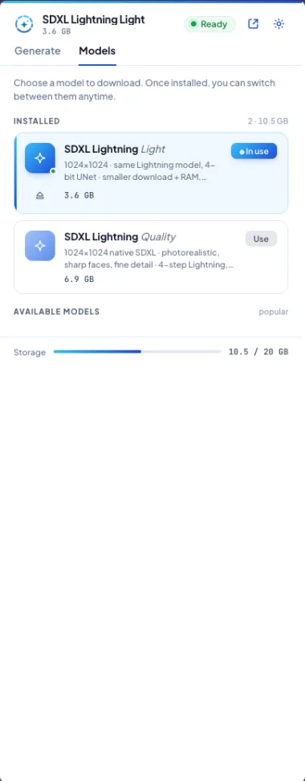
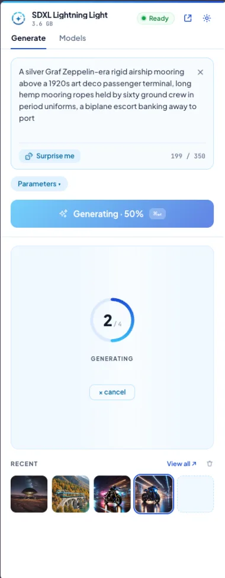
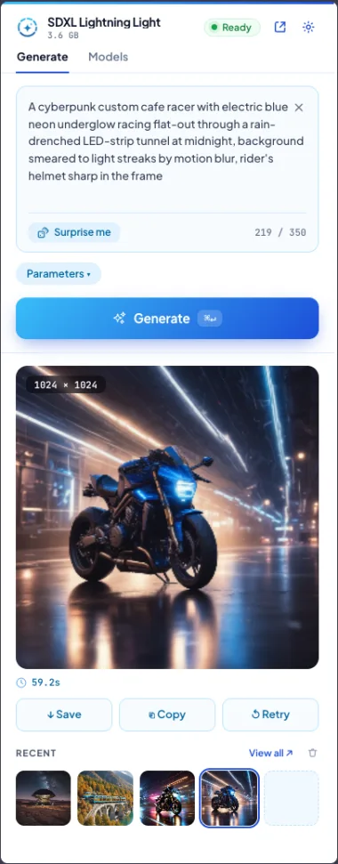
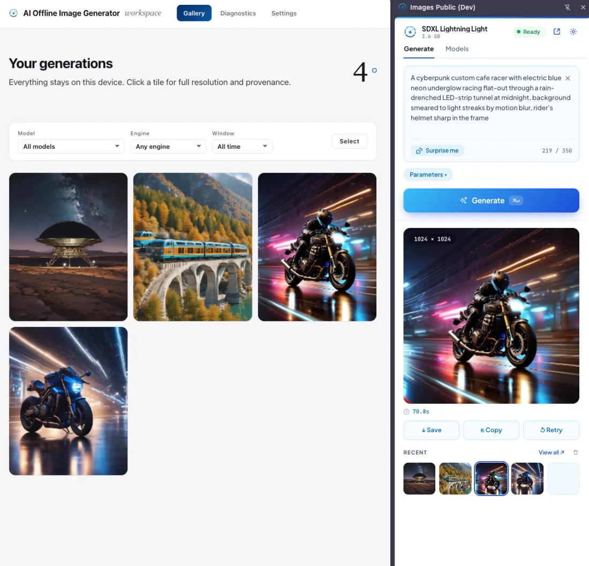

# Generate AI Images

A browser extension that generates images from text **entirely on your device** —
no servers, no accounts, no uploads. Inference runs in the browser on **WebGPU**
via [onnxruntime-web](https://onnxruntime.ai/), so prompts and images never leave
the machine.

Available for **Chrome / Edge** (Manifest V3 side panel) and **Firefox** (Manifest
V3 sidebar).

## Screenshots

<table>
  <tr>
    <td align="center" width="33%">
      <br>
      <sub><b>Models</b> — pick &amp; install</sub>
    </td>
    <td align="center" width="33%">
      <br>
      <sub><b>Generating</b> — live step</sub>
    </td>
    <td align="center" width="33%">
      <br>
      <sub><b>Result</b></sub>
    </td>
  </tr>
</table>

<p align="center">
  <br>
  <sub><b>Workspace</b> — on-device gallery with metadata &amp; export</sub>
</p>

## Examples

Generated locally on WebGPU (SDXL-Lightning, 1024x1024). Previews are web-optimized
WebP — click any one for the full-resolution PNG.

<table>
  <tr>
    <td align="center" width="50%">
      <a href="chrome/img/sample1.png"></a><br>
      <sub><a href="chrome/img/sample1.png">Sample 1 — original PNG</a></sub>
    </td>
    <td align="center" width="50%">
      <a href="chrome/img/sample2.png"></a><br>
      <sub><a href="chrome/img/sample2.png">Sample 2 — original PNG</a></sub>
    </td>
  </tr>
  <tr>
    <td align="center" width="50%">
      <a href="chrome/img/sample3.png"></a><br>
      <sub><a href="chrome/img/sample3.png">Sample 3 — original PNG</a></sub>
    </td>
    <td align="center" width="50%">
      <a href="chrome/img/sample4.png"></a><br>
      <sub><a href="chrome/img/sample4.png">Sample 4 — original PNG</a></sub>
    </td>
  </tr>
</table>

## Features

- **Text → image** with SDXL-Lightning (1024x1024, 4-step) running locally on WebGPU.
- **Fully offline & private** — models download once into the browser's OPFS cache
  and run with no network thereafter.
- **Optional post-processing**: Real-ESRGAN upscale and GFPGAN face restoration.
- **Workspace**: a gallery of your generations with metadata, compare view, and
  ZIP export — all stored on-device.
- **50+ UI languages**, NSFW filter, adjustable steps / guidance / seed.

## Requirements

- A WebGPU-capable browser:
  - Chrome / Edge **122+** (WebGPU on by default).
  - Firefox **142+** (WebGPU shipped; availability is platform-dependent — the
    engine probes and degrades gracefully if it's off).
- A GPU with enough VRAM for the chosen model (SDXL ≈ 8 GB recommended).

> The 4-bit (int4) model variant is **Chrome-only** — Firefox's WebGPU can't yet
> run its `MatMulNBits` kernel, so it's hidden there; Firefox uses the fp16 model.

## Repository layout

```
chrome/        Shared source for BOTH platforms + the build script (build.js)
  background/  service-worker.js (Chrome) + core.js (shared orchestration)
  offscreen/   WebGPU engine: ONNX pipelines (SD / SDXL / upscale / face-restore)
  popup/       Side-panel / sidebar UI (popup.html/js/css, catalog, i18n)
  workspace/   Full-page gallery + diagnostics + settings
  _locales/    52 locales
  tests/       Two-tier automated tests (see chrome/tests/README.md)
firefox/       Firefox overlay: MV3 manifest + background page (see firefox/README.md)
release/       Packaged .zip builds (git-ignored)
```

Firefox reuses the engine, UI, locales and assets from `chrome/`; only the
manifest and background host page differ. See [firefox/README.md](firefox/README.md).

## Build

All tooling lives in `chrome/`:

```bash
cd chrome
npm install

node build.js              # Chrome release  → chrome/dist/  + release/chrome-v<ver>.zip
node build.js --firefox    # Firefox release → firefox/dist/ + release/firefox-v<ver>.zip
node build.js --dev        # + source maps (Chrome DevTools profiling)
node build.js --raw        # no minification
```

## Load the extension

- **Chrome / Edge**: `chrome://extensions` → enable Developer mode → *Load
  unpacked* → select `chrome/dist`.
- **Firefox**: `about:debugging` → This Firefox → *Load Temporary Add-on* → pick
  `firefox/dist/manifest.json`, or `npx web-ext run --source-dir firefox/dist`.

## Tests

Two tiers — logic (fast, Node) and cross-browser UI (real Chromium + Firefox).
Full details and how to add cases: [chrome/tests/README.md](chrome/tests/README.md).

```bash
cd chrome
npm test                                 # Tier 1 — Vitest (logic)
npx playwright install chromium firefox  # one-time, for Tier 2
npm run build && npm run test:e2e        # Tier 2 — Playwright (both browsers)
```

Real model inference (WebGPU + multi-GB downloads) is **not** automated — it's a
manual smoke check; the test suite mocks the engine.

## Privacy

Everything runs locally. No telemetry, no remote inference. Generated images and
all settings stay in the browser's local storage / OPFS on your device.
